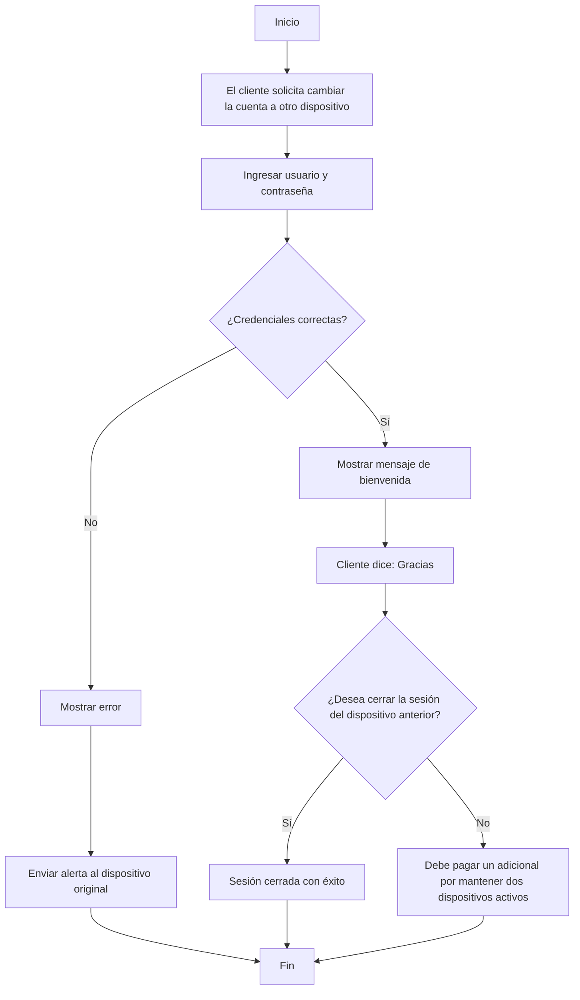

# 🧠 Lógica del Negocio: Servicio de Protección Digital

## 📖 Descripción

**Servicio de Protección Digital** permite a un cliente cambiar su cuenta a un nuevo dispositivo de forma segura. El sistema verifica las credenciales del usuario y, dependiendo del resultado, permite continuar con el proceso o envía una alerta al dispositivo original para proteger la cuenta.

---

## 🔄 Flujo principal



---

## 💻 Pseudocódigo

```text
INICIO

Leer usuario
Leer contraseña

Si credenciales_correctas Entonces

    Mostrar "¡Bienvenido!"
    Mostrar "Gracias"

    Leer cerrar_sesion

    Si cerrar_sesion = "Sí" Entonces
        Mostrar "La sesión del dispositivo anterior se ha cerrado con éxito."
    SiNo
        Mostrar "Debe pagar un adicional por mantener la cuenta en dos dispositivos."
    FinSi

SiNo
    Mostrar "Error: usuario o contraseña incorrectos."
    Mostrar "Se ha enviado una alerta al dispositivo original."
FinSi

FIN
```

---

## 🎮 Simulación en Scratch

- **Nombre del proyecto:** ServicioProteccionDigital-logica
- **Hecho por:** María Paula