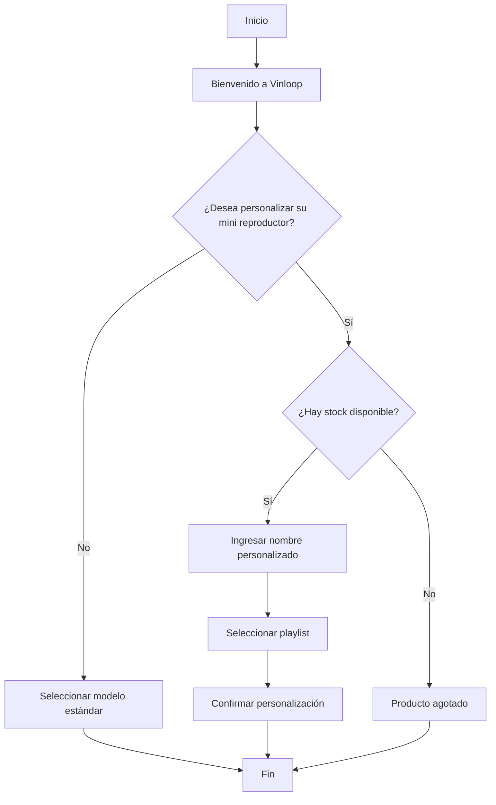

# 🧠 Lógica del Negocio: Vinloop

## 📖 Descripción

**Vinloop** es un emprendimiento que ofrece mini reproductores de música personalizables. El sistema permite al cliente elegir entre un modelo estándar o uno personalizado, verificando primero si existe stock disponible.

---

## 🔄 Flujo principal



---

## 💻 Pseudocódigo

```text
INICIO

Mostrar "Bienvenido a Vinloop"

Leer personalizar

Si personalizar = "Sí" Entonces

    Si hay_stock Entonces

        Leer nombre
        Leer playlist

        Mostrar "Mini reproductor personalizado correctamente."

    SiNo

        Mostrar "Producto agotado."

    FinSi

SiNo

    Mostrar "Se ha seleccionado un modelo estándar."

FinSi

FIN
```

---

## 🎮 Simulación en Scratch

- **Nombre del proyecto:** Vinloop-logica
- **Hecho por:** Domenica