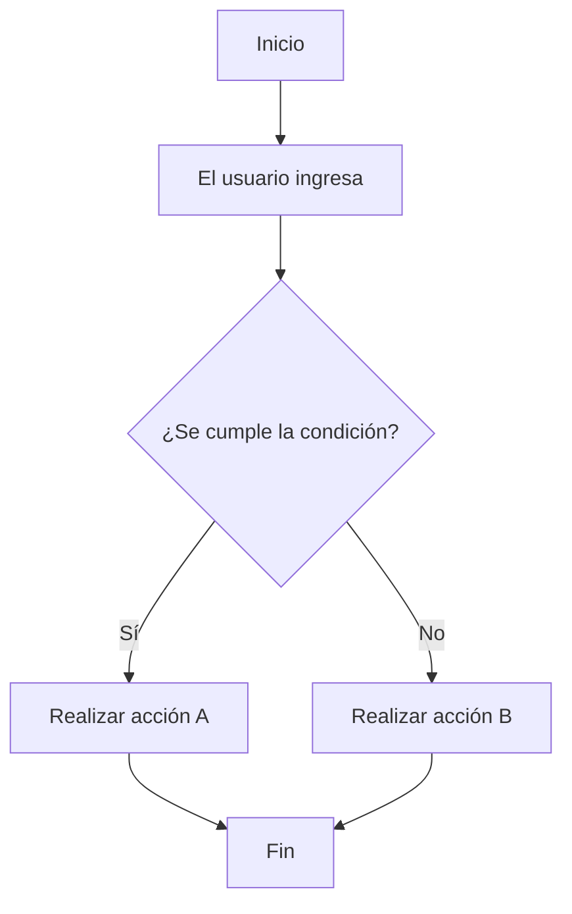

# 🧠 Lógica del Negocio: [Nombre del Proyecto]

## 📖 Descripción

Breve descripción del negocio y el problema que resuelve.

---

## 🔄 Flujo principal



---

## 💻 Pseudocódigo

```text
INICIO

Leer dato

Si condición Entonces
    Mostrar resultado_A
SiNo
    Mostrar resultado_B
FinSi

FIN
```

---

## 🎮 Simulación en Scratch

- **Nombre del proyecto:** `[NombreNegocio]-logica`
- **Hecho por:** `[Domenica]`
