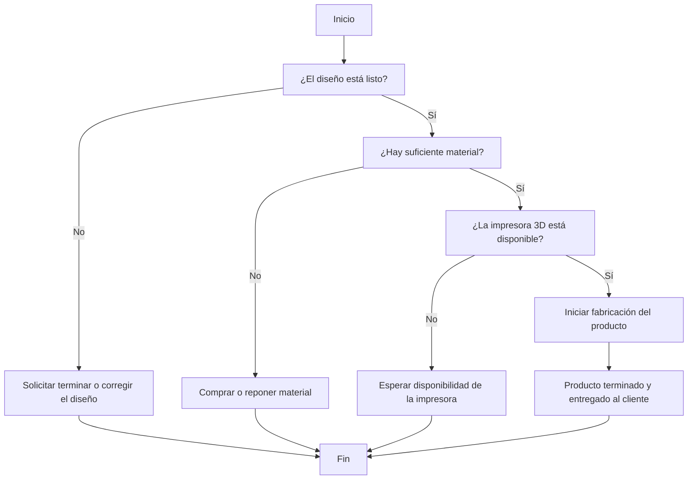

# 🧠 Lógica del Negocio: TechForge 3D

## 📖 Descripción

**TechForge 3D** es un emprendimiento dedicado al desarrollo de software personalizado y la fabricación de piezas mediante impresión 3D. Cuando un cliente realiza un pedido, el sistema verifica si el diseño está listo, si existe suficiente material para fabricar la pieza y si la impresora 3D está disponible. Si alguna condición no se cumple, el sistema informa el problema para evitar errores en la producción.

---

## 🔄 Flujo principal



---

## 💻 Pseudocódigo

```text
INICIO

Leer diseño_listo

Si diseño_listo = "Sí" Entonces

    Leer material_disponible

    Si material_disponible = "Sí" Entonces

        Leer impresora_disponible

        Si impresora_disponible = "Sí" Entonces
            Mostrar "Iniciando fabricación del producto."
            Mostrar "Producto terminado y entregado al cliente."
        SiNo
            Mostrar "La impresora 3D no está disponible. Espere unos minutos."
        FinSi

    SiNo
        Mostrar "No hay suficiente material para fabricar el producto."
    FinSi

SiNo
    Mostrar "El diseño debe corregirse o finalizarse antes de fabricar."
FinSi

FIN
```

---

## 🎮 Simulación en Scratch

- **Nombre del proyecto:** TechForge3D-logica
- **Hecho por:** Geovanny
