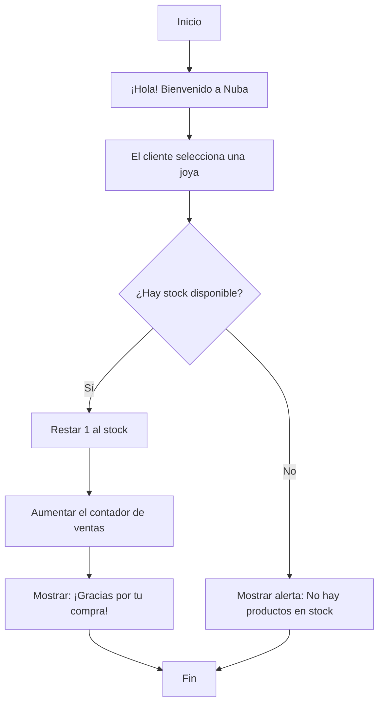

# 🧠 Lógica del Negocio: Nuba

## 📖 Descripción

**Nuba** es un emprendimiento de joyería artesanal que permite a los clientes adquirir joyas personalizadas según sus gustos y preferencias. El sistema verifica si el producto está disponible en el inventario antes de realizar la venta. Cuando la compra es exitosa, el stock disminuye y el contador de ventas aumenta.

---

## 🔄 Flujo principal



---

## 💻 Pseudocódigo

```text
INICIO

Mostrar "¡Hola! Bienvenido a Nuba"

Leer producto

Si stock > 0 Entonces

    stock = stock - 1
    ventas = ventas + 1

    Mostrar "¡Gracias por tu compra!"

SiNo

    Mostrar "No hay productos en stock."

FinSi

FIN
```

---

## 🎮 Simulación en Scratch

- **Nombre del proyecto:** Nuba-logica
- **Hecho por:** Jessi