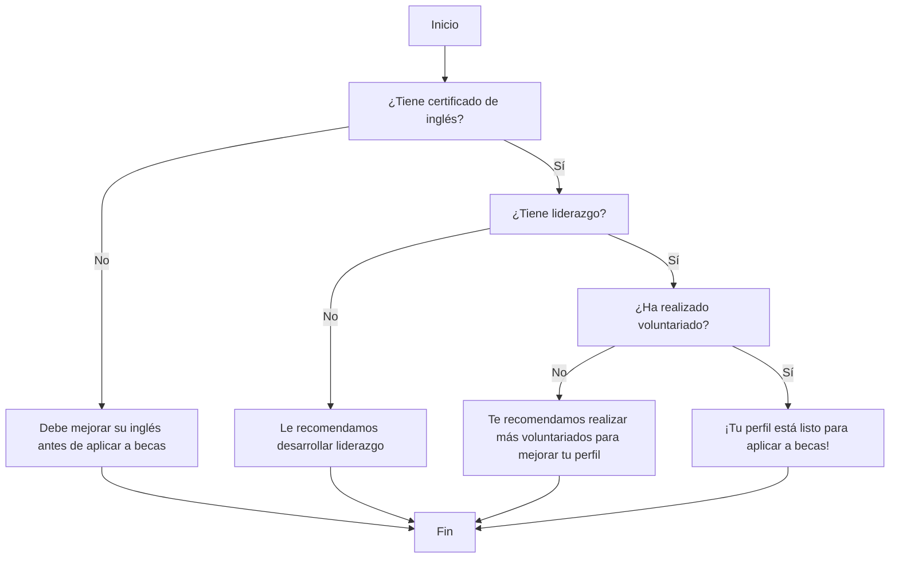

# 🧠 Lógica del Negocio: Inspira+

## 📖 Descripción

**Inspira+** es un sistema que orienta a estudiantes interesados en postular a becas. Evalúa si el usuario cumple con tres requisitos importantes: contar con un certificado de inglés, demostrar liderazgo y haber realizado voluntariados. Si no cumple alguno de estos requisitos, el sistema le brinda una recomendación para mejorar su perfil antes de aplicar.

---

## 🔄 Flujo principal



---

## 💻 Pseudocódigo

```text
INICIO

Leer certificado_ingles

Si certificado_ingles = "Sí" Entonces

    Leer liderazgo

    Si liderazgo = "Sí" Entonces

        Leer voluntariado

        Si voluntariado = "Sí" Entonces
            Mostrar "¡Tu perfil está listo para aplicar a becas!"
        SiNo
            Mostrar "Te recomendamos realizar más voluntariados para mejorar tu perfil."
        FinSi

    SiNo
        Mostrar "Le recomendamos desarrollar liderazgo."
    FinSi

SiNo
    Mostrar "Debe mejorar su inglés antes de aplicar a becas."
FinSi

FIN
```

---

## 🎮 Simulación en Scratch

- **Nombre del proyecto:** Inspira+-logica
- **Hecho por:** Domenica